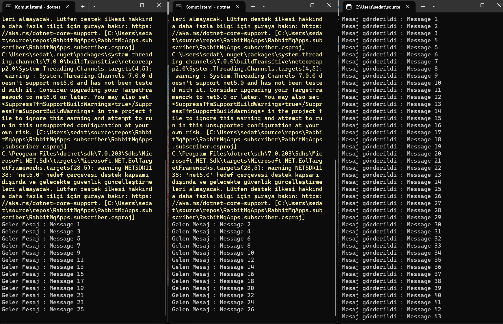
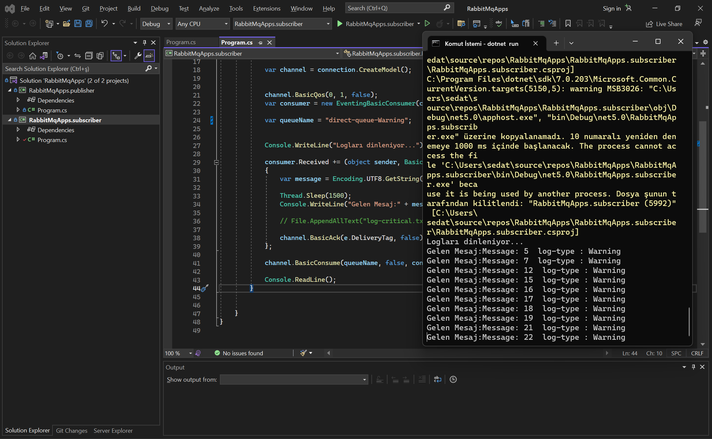

# RabbitMqApps

This repository has been created for using RabbitMQ technology and developing examples and applications with this technology.

### Watermark App

In this application, the names of the uploaded images are sent to the queue, and the BackgroundService within the Web app listens to the queue, retrieves the image name, adds a watermark, and saves the modified image in a new folder.

 

 

### An example application with exchange, queue, publisher, and subscriber.

