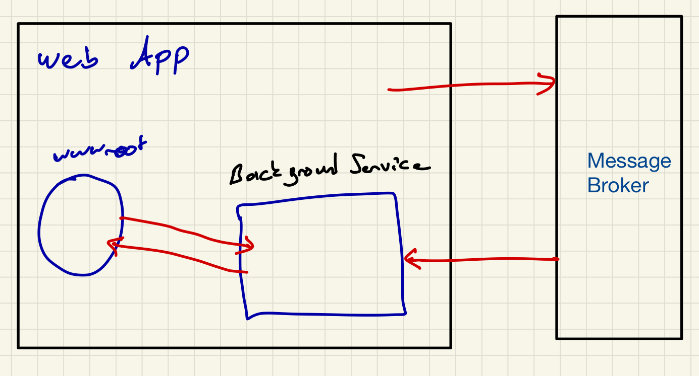
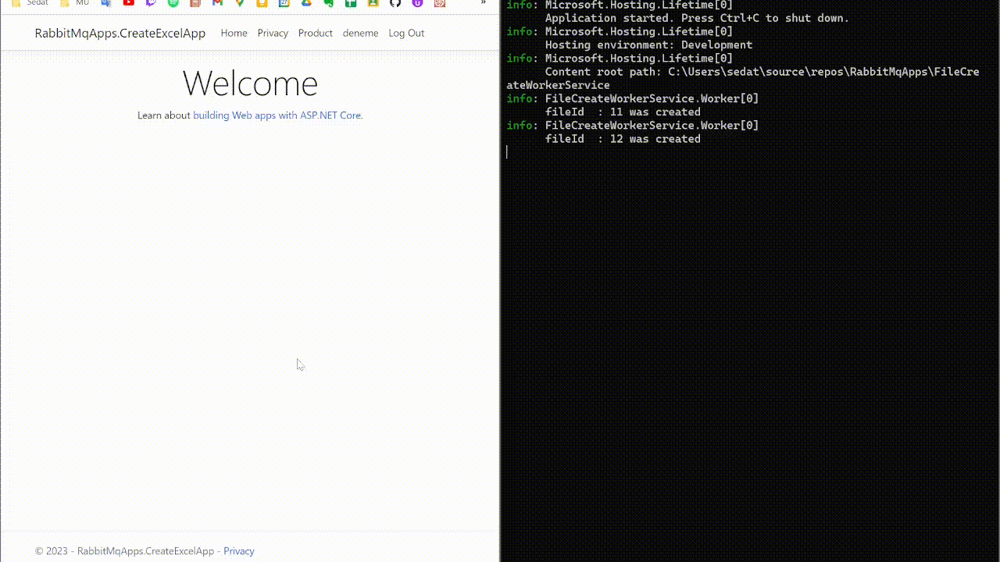

# RabbitMqApps

This repository has been created for using RabbitMQ technology and developing examples and applications with this technology.

### Watermark App

In this application, the names of the uploaded images are sent to the queue, and the BackgroundService within the Web app listens to the queue, retrieves the image name, adds a watermark, and saves the modified image in a new folder.

 

 

### Excel App
A separate worker service processes incoming requests in the background, reports that they have been completed via the API, and sets the status as complete.

 

### An example application with exchange, queue, publisher, and subscriber.

